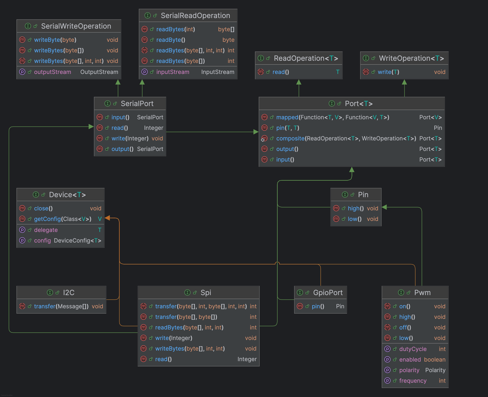

# PJs

> Basic hardware abstractions for Raspberry Pi development on the JVM

PJs (pronounced "pee-jays") is a hardware abstraction layer for the Raspberry Pi that runs on the JVM. 
Its core API is based on the premise that IO interactions essentially boil down to reading and writing 
numbers.

For example:
* Reading and writing to a GPIO pin is essentially a read or write of a binary value.
* Reading and writing two pins simultaneously is essentially a read or write of a value between 0 and 3.
* Read/write of more pins therefore becomes a read or write of an arbitrary number of bits which can be represented 
 as a number.

API design is hard. Every design decision is an expression of an opinion and an attempt to express to others 
 your understanding of the problem domain. The more decisions you make, the more opinions you express, and the larger
 the risk surface becomes for disagreement and misunderstanding. As engineers, we are trained to avoid risk by reducing 
 the risk surface. One way to do this in the context of API design is to state the fewest opinions possible. 

The primary option stated the PJs APIs is that hardware interactions are predominantly read and write 
 operations of one or many numbers and that it isn't too hard to express this via a handful of basic abstractions. 

With this as a central premise, the PJs APIs aim to be as unopinionated as possible. Rather than attempting to provide
 a solution for an unknown number of use cases, they focus on providing a set of generic hardware abstractions that 
 can be used as building blocks to solve use cases as they arise. 

The core API includes specifications for two primary responsibilities:

## Hardware Abstractions

Hardware abstractions (primarily `Port<>`, `Pin` and `SerialPort`) provide applications with access to hardware at 
 runtime.

Applications would typically use these abstractions to interact with hardware directly, without needing to be aware of
 the underlying implementation details. Application logic would be written against these abstractions rather than the 
 underlying device adapters. 

* [PORTS.md](docs/PORTS.md) - An overview and example usage of the PJs `Port<>` and `Pin` abstractions.
* [SERIAL.md](docs/SERIAL.md) - An overview and example usage of the PJs `SerialPort`, `SPI` and `I2C` abstractions.

## Device Adapters

Device adapters implement the transport layer used by the hardware abstractions. They are responsible for managing 
 any resources (such as file descriptors, HTTP or gRPC clients) and implementing the actual IO operations.

Applications would typically only be aware of these specific types during construction when configuring 
 access to hardware. Runtime references to these instances would be via the hardware abstractions they implement.  

Device adapters provided in this repository include:

* [pjs-native-device](providers/pjs-native) - Adapters which communicate with hardware via Java FFM APIs
* [pjs-mock-device](providers/pjs-mock-device) - Mock device adapters which can be used for testing
* [pjs-grpc-device](providers/network/pjs-grpc) - Device adapters and server application which allow PJs to 
communicate with a remote Pi via gRPC
* [pjs-http-device](providers/network/pjs-http) - Device adapters and server application which allow PJs to
  communicate with a remote Pi via REST
* [pjs-pi4j-device](providers/pjs-pi4j-device) - Device adapter which uses [Pi4J](https://www.pi4j.com) providers to 
communicate with hardware

## Examples

The [pjs-sandbox](pjs-sandbox) module contains a number of examples that demonstrate how to use the PJs APIs, along
 with examples of PJs abstractions used to implement specific hardware devices.

The implemented devices currently include:
* [pjs-device-eeprom](pjs-sandbox/pjs-device-eeprom) - A PJs SPI implementation for the 24LC256 EEPROM. 
* [pjs-device-mcp23x](pjs-sandbox/pjs-device-mcp23x) - PJs SPI and I2C implementations for the MCP23008/S08 port
 expander.
* [pjs-device-sh1106](pjs-sandbox/pjs-device-sh1106) - A PJs I2C implementation for the SH1106 OLED display.

[pjs-examples](pjs-sandbox/pjs-examples) contains a number of examples that demonstrate how to use the PJs APIs.
